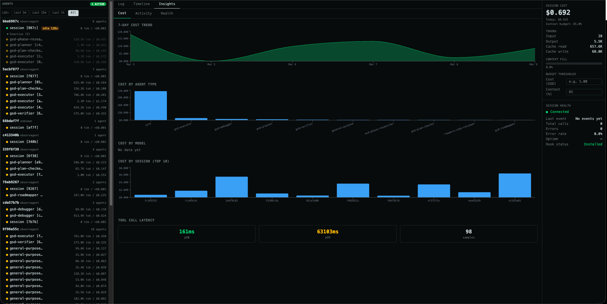
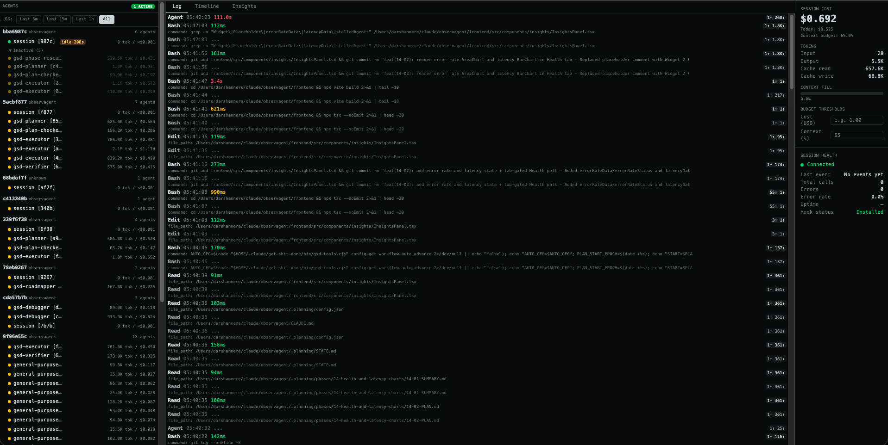

<h1 align="center">ObservAgent</h1>

<p align="center">
  <strong>Local-first observability for Claude Code power users running multi-agent workflows</strong><br>
  Built for developers who want real-time visibility into cost, tools, latency, and subagents while the session is still running.
</p>

<p align="center">
  <a href="#-quick-start"></a>
  <a href="#-features"></a>
  <a href="#-architecture"></a>
  <a href="#-configuration"></a>
</p>

<p align="center">
  
  =18">
  
</p>

<p align="center">
   &nbsp;
  
</p>

⭐ If ObservAgent helps you understand or reduce Claude Code costs, consider starring the repo — it helps guide future development.

**ObservAgent turns Claude Code into a live, debuggable system.**  
No wrappers. No SDKs. No cloud. Just visibility.

---

## ❓ Why ObservAgent?

Claude Code sessions get expensive and opaque fast.

- Why did this run cost $3?
- Which tool is slowing everything down?
- Why did the agent silently fail?

Claude writes JSONL transcripts, but they’re not usable in real time.

ObservAgent gives you complete visibility into your Claude Code sessions without any code changes:

- 💰 **Cost Tracking** — Real-time token usage per model with automatic cost calculation  
- 🔧 **Tool Monitoring** — See every tool call, latency, and success/failure status  
- 🧩 **Agent Visibility** — Session + subagent timeline and filtering  
- 🪝 **Zero Integration** — Works via Claude Code hooks  
- 🔒 **Local & Private** — Server binds to `127.0.0.1`; no telemetry pipeline  

---

## 🚀 Quick Start

### TL;DR (30 seconds)

```bash
npm install -g @darshannere/observagent
observagent init
observagent start
```
Run a Claude Code session and open http://localhost:4999 to watch it live.


### 1. Install

> ObservAgent is currently published as a beta.

```bash
npm install -g @darshannere/observagent
```

Or clone and run locally:

```bash
git clone https://github.com/darshannere/observagent.git
cd observagent
npm install
npm --prefix frontend install
npm --prefix frontend run build
```

### 2. Configure Claude Code Hooks

Recommended (automatic):

```bash
observagent init
```

This installs `relay.py` to `~/.claude/observagent/relay.py` and registers hooks in `~/.claude/settings.json`.

Manual option (if you prefer):

```json
{
  "hooks": {
    "PreToolUse": [{ "hooks": [{ "type": "command", "command": "python3 /absolute/path/to/relay.py" }] }],
    "PostToolUse": [{ "hooks": [{ "type": "command", "command": "python3 /absolute/path/to/relay.py" }] }],
    "SubagentStart": [{ "hooks": [{ "type": "command", "command": "python3 /absolute/path/to/relay.py" }] }],
    "SubagentStop": [{ "hooks": [{ "type": "command", "command": "python3 /absolute/path/to/relay.py" }] }]
  }
}
```

### 3. Start ObservAgent

```bash
observagent start
```

This opens the dashboard at `http://localhost:4999`.

---

## ✨ Features

### Real-Time Session Monitoring

> Every tool call streams instantly to the dashboard via SSE.

### Cost Analytics

> Automatic cost calculation from Claude JSONL usage records, including cache token handling.

### Latency Insights

> Track per-tool timing and identify slow calls quickly.

### Error Monitoring

> Track failed tool calls and session health metrics.

### Session + Subagent Filtering

> Click a session to filter that session, or a subagent to filter only that subagent’s calls.

### History Panel (Repo-Level)

> The History page (`/history`) groups sessions by repository/project name so users can quickly see:

- how many sessions each repo has
- per-session cost, model, and last event time
- which sessions are active (`● active`) or have errors (`err`)
- one-click replay into live mode
- one-click log export in **JSONL** or **CSV**

---


## 🧠 Architecture

```text
┌─────────────────┐     HTTP POST      ┌─────────────────┐
│  Claude Code    │──────────────────► │   ObservAgent   │
│    (hooks)      │   relay.py         │    Server       │
└─────────────────┘                    │                 │
                                       │  ┌───────────┐  │
                                       │  │  SQLite   │  │
                                       │  │  Database │  │
                                       │  └───────────┘  │
                                       └────────┬────────┘
                                                │ SSE + API
                                                ▼
                                       ┌─────────────────┐
                                       │   Dashboard     │
                                       │   (React SPA)   │
                                       └─────────────────┘
```

### Components

| Component | Purpose |
|-----------|---------|
| `hooks/relay.py` | Claude hook relay (fire-and-forget POST to `/ingest`) |
| `server.js` | Fastify server + route registration |
| `lib/jsonlWatcher.js` | Watches `~/.claude/projects` JSONL for usage/cost updates |
| `lib/costEngine.js` | Pricing + cost aggregation |
| `routes/` | Ingest, SSE, API, dashboard routes |
| `frontend/` | React dashboard source (built to `public/dist`) |

---

## ⚙️ Configuration

### CLI Commands

```bash
observagent init
observagent start
observagent doctor
```

### Environment Variables

| Variable | Default | Description |
|----------|---------|-------------|
| `PORT` | `4999` | Server port |
| `OBSERVAGENT_DB_PATH` | `./observagent.db` | SQLite database path |

When started via `observagent start`, DB defaults to:
- **macOS/Linux**: `~/.local/share/observagent/observagent.db`
- **Windows**: `%APPDATA%/observagent/observagent.db`

---

## API Endpoints

| Endpoint | Method | Description |
|----------|--------|-------------|
| `/ingest` | POST | Receive hook events |
| `/events` | GET | SSE stream |
| `/api/health` | GET | Dashboard health metrics |
| `/api/agents` | GET | Agent tree data |
| `/api/events` | GET | Tool events |
| `/api/cost` | GET | Session cost summary |
| `/api/config` | GET/POST | Budget and threshold config |
| `/api/sessions` | GET | Session history list |
| `/api/sessions/:id/export` | GET | Export session data |

---

## 📦 Requirements

- **Node.js** 18+
- **Python 3** (for hook relay)
- **Claude Code**

---

## 🛠️ Troubleshooting

### Hook Not Triggering

Run:

```bash
observagent doctor
```

Ensure hooks exist in `~/.claude/settings.json` and use absolute paths.

### Server Won't Start

Check if port 4999 is already in use:

```bash
lsof -i :4999
```

### No Data Appearing

1. Verify server is running: `observagent start`
2. Verify hooks are installed: `observagent init`
3. Verify Claude session files exist under `~/.claude/projects`


---

## 📄 License

Apache License 2.0 — see [`LICENSE`](./LICENSE).

---

## 🤝 Contributing

Contributions welcome. Open an issue or PR.
